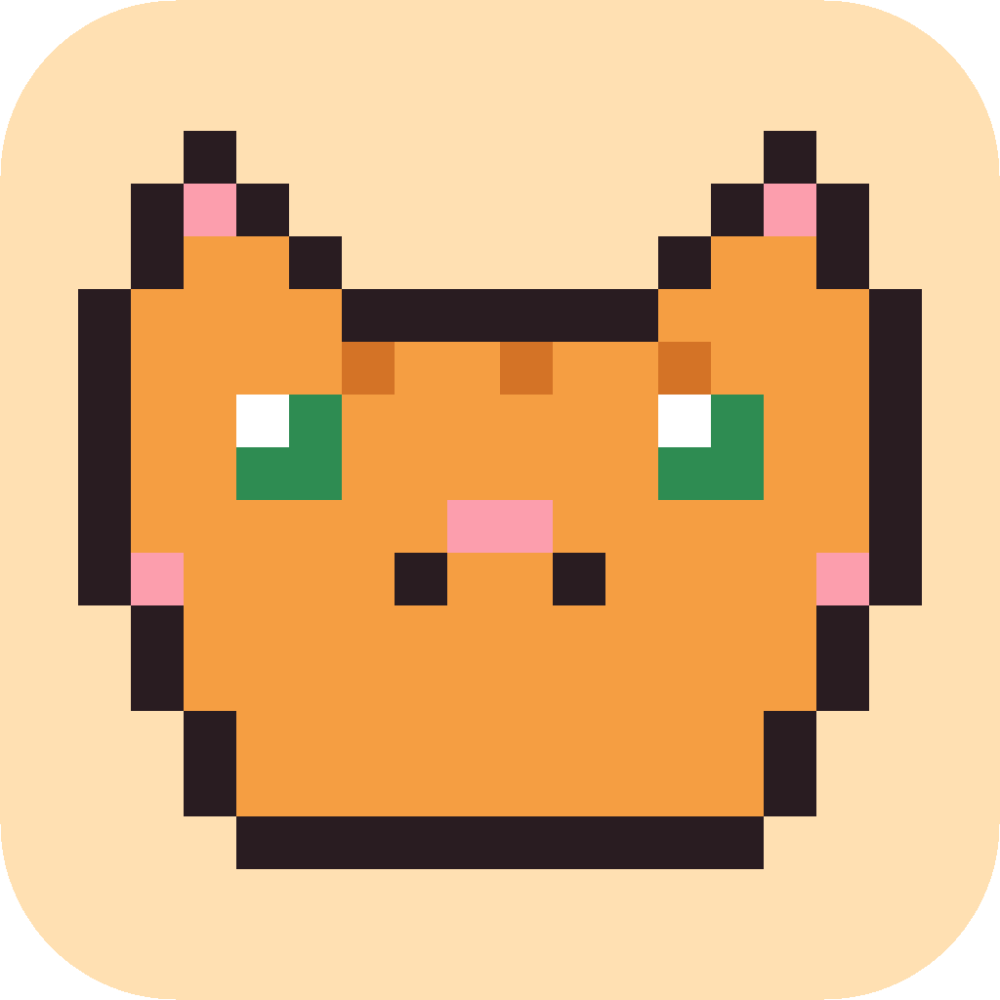

# CatBreak 🐈

A tiny macOS menu bar app that makes you take care of yourself while you work.
Every hour, a pixelated cat takes over your screen and won't let you back to
work until you've done your wellness checklist.



## What it does

- **Lives in your menu bar** with a live countdown to the next break (`🐈 42:17`).
- **Every hour** (starting from when you open the app) it dims your whole
  screen with a blurry overlay. A cute pixel cat appears and asks you to:
  - 👀 Look at something far away for 20 seconds (with a built-in 20s timer)
  - 🪑 Straighten your back & drop your shoulders
  - 🤸 Stand up and stretch
- **Every two hours** it also adds: 💧 Sip some water.
- The overlay **only disappears after you tick every box** and press
  "Back to work!". Until then, the blur stays.
- Works across multiple monitors (all screens are dimmed; the checklist shows
  on your main screen).

The menu bar menu also lets you take a break early, restart the timer, or quit.

## Download & install

1. Go to the [**latest release**](../../releases/latest) and download `CatBreak.zip`
   (or grab the `CatBreak` artifact from the latest run on the
   [Actions tab](../../actions)).
2. Unzip it and drag `CatBreak.app` into your **Applications** folder.
3. The app is not notarized with Apple (no developer certificate), so macOS
   will block the first launch. Remove the quarantine flag once:

   ```bash
   xattr -dr com.apple.quarantine /Applications/CatBreak.app
   ```

   Alternatively: try to open the app, then go to
   **System Settings → Privacy & Security** and click **Open Anyway**.
4. Open CatBreak. The 🐈 appears in your menu bar and the first hour starts
   counting down.

To launch it automatically when you log in: **System Settings → General →
Login Items** → add CatBreak.

## Build from source

Requires macOS 13+ with Xcode command line tools:

```bash
bash scripts/build_app.sh
open build/CatBreak.app
```

Or just run it directly during development with `swift run`.

## Project layout

| Path | Purpose |
| --- | --- |
| `Sources/CatBreak/AppDelegate.swift` | Menu bar item, break scheduling |
| `Sources/CatBreak/OverlayWindowController.swift` | Full-screen blur/dim overlay windows |
| `Sources/CatBreak/BreakView.swift` | Checklist UI shown during a break |
| `Sources/CatBreak/PixelCatView.swift` | The pixel-art cat (it blinks!) |
| `scripts/build_app.sh` | Builds the universal `.app` bundle |
| `scripts/generate_icon.py` | Regenerates the app icon from the pixel grid |
| `.github/workflows/build.yml` | CI: builds the app and publishes the release |
